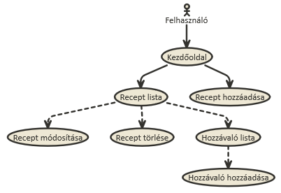
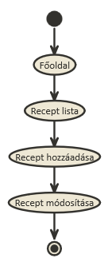
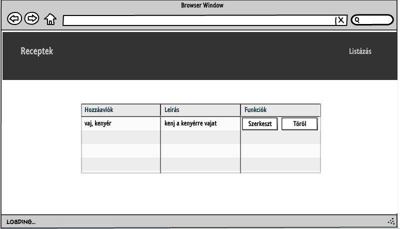
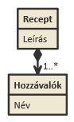

# Második Alkalmazások fejlesztése beadandó
##Recept gyűjtemény

***

###Követelményanalízis

A program receptek és hozzávalóik nyilvántartására ad lehetőséget.

Funkcionális elvárások:
  + Listázza a recepteket
  + Lehetőség legyen új recept hozzáadására
  + Lehetőség legyen már a listához adott receptek szerkesztésére, valamint törlésükre
  + Lehetőség legyen a receptekhez hozzávaló(ka)t megadni

Nem funkcionális elvárások:
  + Könnyű kezelhetőség
  + Átlátható, reszponzív dizájn

Szakterületi fogalomjegyzék: nincsenek speciális szakkifejezések.

Használatieset-modell
  Szerepkörök: 
  + nincsenek szerepkörök, a felhasználók minden funkcióhoz hozzáférnek
  
Használati eset diagram:

Lehetséges folyamat példa:

***

###Tervezés

Architektúra terv:
  + Publikus:
    + Főoldal
    + Receptek listája
        + új recept hozzáadása
        + meglévő recept szerkesztése
        + meglévő recept törlése
        + hozzávalók listája
            + új hozzávaló hozzáadása

Végpontok:
  + főoldal
  + foods
    + list
    + new
    + edit
  + ingredients
    + list
    + new

Felhasználóifelület-modell:
  + Oldalvázlat:
  

Osztálymodell:
  + Adatmodell (és adatbázisterv):
  
  

  + Dinamikus működés:
    Az alkalmazás 'hbs' fájlokkal (template-ekkel) dinamukusan változtatja a nézeteit.

***

###Implementáció

1. Fejlesztői környezet bemutatása:
    az alkalmazást a Cloud9 Web IDE segítségével online hoztam létre és szerkesztettem. 
    Futtatókörnyezetként is a Web IDE szolgált a fejlesztés során.

2. Könyvtárstruktúrában lévő mappák funkiójának bemutatása:
    + config: az "environment.js" fájlt tartalmazza
    + az alkalmazás lényegi része az app mappában van, itt található meg az applikáció Ember JS segítségével létrehozott állománya,
    a modellek, controller-ek, route-ok, template-ek, illetve a REST API-hoz szükséges adapter is.
    + a dokumentáció a főkönyvtárban van, a hozzá tartozó képek pedig a documentation_images mappában

***

###Felhasználói dokumentáció

Rendszerigény: 
  + Modern böngészőket futtató hardver
  + Internetkapcsolat

Telepítés: nem szükséges telepíteni az alkalmazást, elérhető online böngészőből. Offline használathoz le kell tölteni a "gyak09" mappát.

A program használata:
  + Főoldalon a "Listázás" gombra kattintva érheti el a receptek listáját
  + Új receptet az erre szolgáló gombbal adhatunk hozzá a listához
  + Meglévő receptet a "Szerkeszt" gombbal szerkeszthetünk, a "Törlés" gombbal törölhetünk